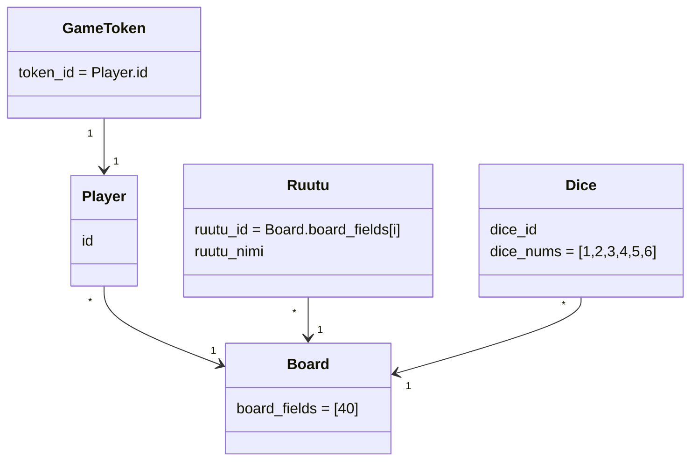

```mermaid
 classDiagram
      Player "*" --> "1" Board
      class Board{
         board_fields = [40]

      }
      class Player{
          id
      }


      Ruutu "*" --> "1" Board
      class Ruutu{
         ruutu_id = Board.board_fields[i]
         ruutu_nimi
      }


      Dice "*" --> "1" Board
      class Dice{
         dice_id
         dice_nums = [1,2,3,4,5,6]
      }

      GameToken "1" --> "1" Player
      class GameToken{
         token_id = Player.id
      }

```